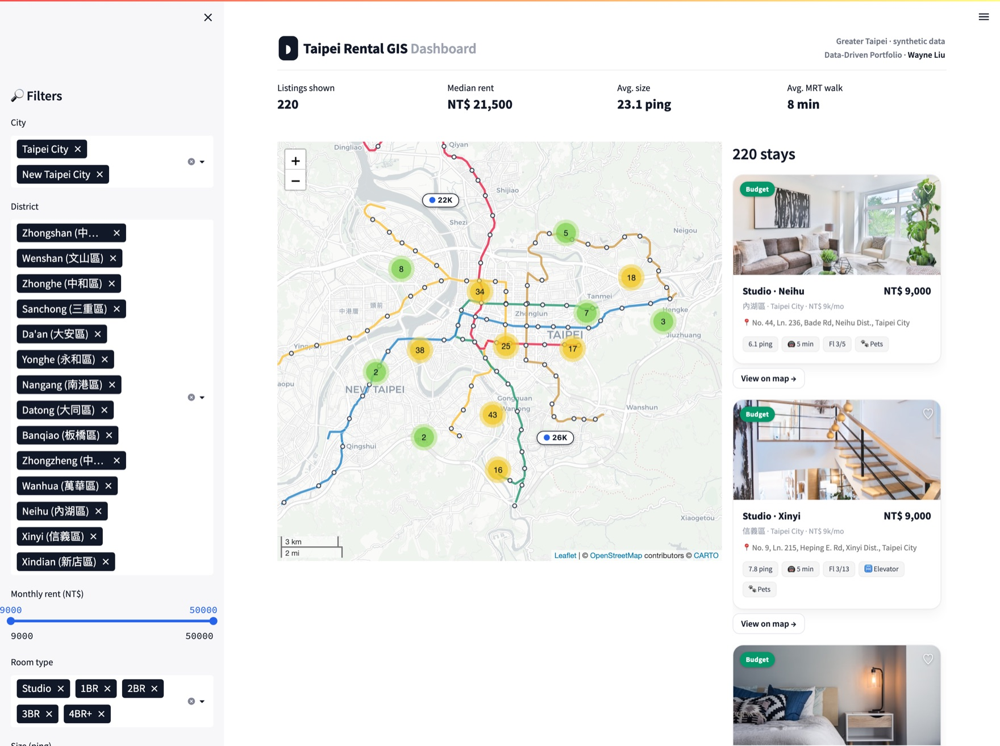

# 🏙️ Taipei Rental GIS Dashboard

An **Airbnb-style, interactive rental map** of Greater Taipei — filter thousands
of listings by district, price, size and MRT distance, then click any card or
map pin to fly to it and inspect the details. Built with **Streamlit + Folium**
on a **SQLite** backend.

[](https://github.com/wayneliu0297/taipei-rental-gis-dashboard/actions/workflows/ci.yml)
[](https://taipei-rental-gis-dashboard.streamlit.app)

[](LICENSE)

> ⚠️ **Fake / sample data only.** Every listing is randomly generated and the
> photos are royalty-free stock images. No real listings, addresses, contacts,
> or company data appear anywhere in this repository. See
> [Data & privacy](#-data--privacy).



**▶ Live demo:** https://taipei-rental-gis-dashboard.streamlit.app

---

## ✨ Features

- **Interactive Folium map** with Airbnb-style **price-pill markers** (white →
  black when selected), marker clustering, and a clean CartoDB Positron basemap.
- **Taipei MRT network overlay** — all lines in their official colours
  (Tamsui–Xinyi, Songshan–Xindian, Zhonghe–Xinlu, Bannan, Wenhu) plus **111
  station markers** (hover for the station name).
- **Pinned map, scrollable listings** — the map stays in view while the property
  cards scroll in their own pane (Airbnb desktop layout).
- **220 synthetic listings** across **14 districts** of Taipei City & New Taipei
  City, scattered around real district centroids.
- **Six live filters** — city, district, monthly rent, room type, unit size, and
  max walking distance to MRT.
- **Photo property cards** with price band, amenities, and a *View on map* action.
- **"Fly to" interaction** — click a card or a map pin to recenter, zoom and
  highlight the listing, with a full detail panel (hero photo + specs) below.
- **Live KPI header** — median rent, average size and average MRT walk update
  with every filter change.
- **SQLite backend** with a parameterised query layer, rebuilt automatically on
  first run.

---

## 🧰 Tech stack

| Layer    | Tool                                   |
|----------|----------------------------------------|
| UI       | [Streamlit](https://streamlit.io)      |
| Map      | [Folium](https://python-visualization.github.io/folium/) + `streamlit-folium` |
| Data     | pandas                                 |
| Storage  | SQLite                                 |
| CI       | GitHub Actions + pytest (Py 3.9 / 3.11 / 3.12) |

---

## 🚀 Getting started

No API keys, no external services — it runs entirely offline.

```bash
# 1. (optional) create a virtual environment
python -m venv .venv && source .venv/bin/activate

# 2. install dependencies
pip install -r requirements.txt

# 3. run the app  (the SQLite DB is built automatically on first launch)
streamlit run app.py
```

Then open <http://localhost:8501>.

To (re)generate the synthetic database manually:

```bash
python -m src.generate_data
```

---

## 🗂️ Project structure

```
taipei-rental-gis-dashboard/
├── app.py                  # Streamlit UI: map + cards + filters + detail panel
├── requirements.txt
├── LICENSE                 # MIT
├── .streamlit/config.toml  # light theme
├── .github/workflows/ci.yml
├── assets/
│   ├── screenshot.jpg
│   └── photos/             # royalty-free interior photos (embedded in cards)
├── data/                   # generated SQLite DB (git-ignored, auto-built)
├── src/
│   ├── config.py           # districts, room types, pricing tiers, helpers
│   ├── generate_data.py    # builds the synthetic dataset -> SQLite
│   ├── database.py         # parameterised query layer (pandas + sqlite3)
│   └── media.py            # photo helpers (base64-embedded, offline-safe)
└── tests/                  # pytest suite (config / generator / database / media)
```

---

## 🧪 Testing

```bash
pip install pytest
pytest -q
```

The suite covers the config invariants, the data generator (determinism, value
ranges, price-band logic), every database filter, and the media helpers. CI runs
it on Python 3.9, 3.11 and 3.12 on every push and pull request.

---

## 🔐 Data & privacy

This is a **public portfolio project**, so it ships with **synthetic data only**:

- Listings are generated by [`src/generate_data.py`](src/generate_data.py) with a
  fixed random seed. Their *statistical shape* (per-district rent-per-ping,
  sizes, MRT distances, amenity rates) was calibrated to **aggregate** figures
  from a private reference dataset — never individual records. No real address,
  price, phone number, or company name is stored or displayed.
- Interior photos are royalty-free stock images (Unsplash license — free to use,
  no attribution required) and are illustrative, not pictures of real units.
- Rent figures are indicative and reflect a managed-rental price band, not the
  current open market.

**Credits:** Taipei MRT line geometry is derived from the open-source
[`leoluyi/taipei_mrt`](https://github.com/leoluyi/taipei_mrt) dataset (public
route data). Basemap © OpenStreetMap contributors, © CARTO.

---

## 📄 License

[MIT](LICENSE) © 2026 Wei-Ting (Wayne) Liu
